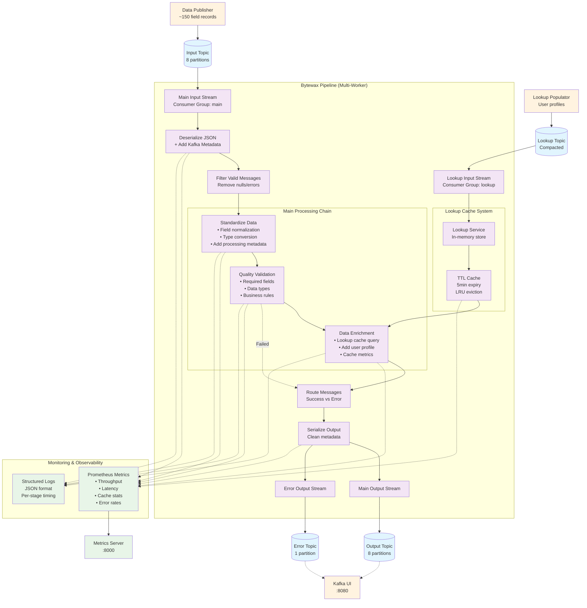
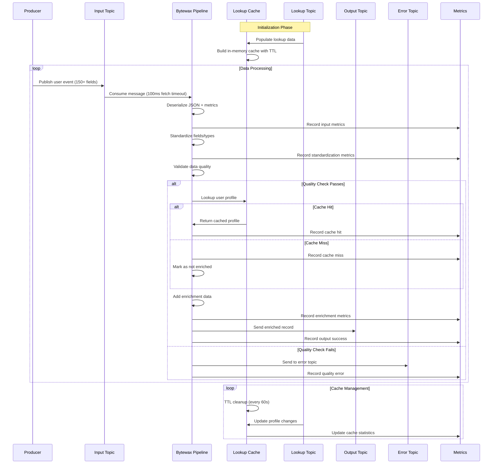

# Bytewax Data Pipeline POC

A proof-of-concept implementation of a near real-time data pipeline using Bytewax, a Python-based stream processing framework. This pipeline processes data from Kafka sources, performs transformations and enrichments, and outputs to Kafka sinks.

## Features

- **Real-time Stream Processing**: Built on Bytewax for high-performance stream processing
- **Data Standardization**: Automatic field normalization, type conversion, and timestamp standardization
- **Quality Validation**: Comprehensive data quality checks with configurable rules
- **Data Enrichment**: Lookup cache for user profile enrichment with TTL-based caching
- **Error Handling**: Robust error handling with dead letter queues
- **Monitoring**: Prometheus metrics and structured logging
- **Parallel Processing**: Support for multiple workers on partitioned Kafka topics

## Architecture

### Data Flow Overview



### Component Interaction Details



### Components

#### Core Pipeline (`pipeline/`)
- **`main.py`**: Main dataflow orchestration and operator configuration
  - Kafka input/output streams with consumer groups
  - Processing pipeline: deserialize → standardize → validate → enrich → serialize
  - Error handling and metrics collection throughout
  - Detailed comments explaining each processing stage
- **`sources.py`**: Kafka message deserialization and metadata handling
- **`sinks.py`**: Kafka message serialization and topic routing

#### Data Transformations (`pipeline/transformations/`)
- **`standardization.py`**: Field normalization and type conversion
  - camelCase → snake_case field name conversion
  - Timestamp parsing and standardization
  - Data type coercion and validation
- **`quality_checks.py`**: Business rule validation and data quality checks
  - Required field validation
  - Data type and range checks
  - Custom business logic validation

#### Data Enrichment (`pipeline/enrichment/`)
- **`lookup_cache.py`**: TTL-based in-memory cache for user profiles
  - LRU cache with time-based expiration (5 min default)
  - Cache hit/miss metrics and statistics
  - Lookup service for profile retrieval and updates

#### Configuration (`config/`)
- **`settings.py`**: Centralized configuration management
  - Environment variable loading with defaults
  - Kafka, processing, metrics, and logging configurations
  - Type-safe dataclass configuration objects

#### Monitoring (`utils/`)
- **`metrics.py`**: Prometheus metrics collection
  - Processing latency and throughput metrics
  - Cache performance statistics
  - Error tracking by stage and type
- **Structured logging**: JSON-formatted logs with context

#### Utilities (`utils/`)
- **`data_publisher.py`**: Sample data generator with ~150 realistic fields
- **`populate_lookup.py`**: User profile data publisher for lookup topic
- **`update_partitions.py`**: Kafka topic partition management
- **`test_timestamp.py`**: Timestamp parsing validation

## Quick Start

### Prerequisites

- Python 3.12+
- Docker and Docker Compose (for local Kafka)

### Setup

1. **Clone and setup the project:**
```bash
cd bytewax-poc
python3.12 -m venv venv
source venv/bin/activate  # On Windows: venv\Scripts\activate
pip install -r requirements.txt
```

2. **Configure environment:**
```bash
cp .env.template .env
# Edit .env with your configuration
```

3. **Start local Kafka infrastructure:**
```bash
docker-compose up -d
```

4. **Populate lookup data:**
```bash
python utils/populate_lookup.py --count 1000
```

5. **Run the pipeline:**
```bash
python -m bytewax.run pipeline.main:flow
```

6. **Publish sample data (in another terminal):**
```bash
python utils/data_publisher.py --rate 10
```

## Configuration

Configuration is managed through environment variables in `.env` file:

### Kafka Configuration
- `KAFKA_BOOTSTRAP_SERVERS`: Kafka broker addresses (default: localhost:9092)
- `KAFKA_SOURCE_TOPIC`: Input topic name (default: input-topic)
- `KAFKA_SINK_TOPIC`: Output topic name (default: output-topic)
- `KAFKA_LOOKUP_TOPIC`: Lookup data topic (default: lookup-topic)
- `KAFKA_ERROR_TOPIC`: Error/dead letter topic (default: error-topic)
- `KAFKA_FETCH_MAX_WAIT_MS`: Max time to wait for data before returning (default: 100ms, maps to fetch.wait.max.ms)
- `KAFKA_FETCH_MIN_BYTES`: Minimum bytes to wait for before returning (default: 1 byte)

#### Performance Tuning Trade-offs

**Current Settings (Optimized for Low Latency):**
- `KAFKA_FETCH_MAX_WAIT_MS=100`: Pipeline completes quickly when producer stops (100ms vs 500ms default)
  - Note: Maps to Kafka's `fetch.wait.max.ms` property
- `KAFKA_FETCH_MIN_BYTES=1`: Processes data immediately when available

**Alternative Configurations:**

**For Maximum Throughput (High Data Volume):**
```bash
KAFKA_FETCH_MAX_WAIT_MS=500    # Allow more batching
KAFKA_FETCH_MIN_BYTES=65536    # Wait for 64KB batches
```
- **Pros**: Higher throughput, fewer CPU cycles, better network efficiency
- **Cons**: Higher latency, slower completion when producer stops

**For Ultra-Low Latency (Real-time Applications):**
```bash
KAFKA_FETCH_MAX_WAIT_MS=50     # Even faster completion
KAFKA_FETCH_MIN_BYTES=1        # Immediate processing
```
- **Pros**: Minimal latency, fastest completion
- **Cons**: More CPU overhead, more network requests

**Default Kafka Settings (Before Our Changes):**
```bash
KAFKA_FETCH_MAX_WAIT_MS=500    # Standard timeout
KAFKA_FETCH_MIN_BYTES=1        # No batching wait
```
- **Pros**: Balanced approach, good for most use cases
- **Cons**: Noticeable delay when producer stops (up to 500ms per fetch)

### Processing Configuration
- `PIPELINE_WORKERS`: Number of parallel workers (default: 2)
- `CACHE_TTL_SECONDS`: Lookup cache TTL in seconds (default: 300)

### Monitoring Configuration
- `METRICS_PORT`: Prometheus metrics port (default: 8000)
- `METRICS_ENABLED`: Enable metrics collection (default: true)
- `LOG_LEVEL`: Logging level (default: INFO)

## Usage

### Running the Pipeline

**Single worker:**
```bash
python -m bytewax.run pipeline.main:flow
```

**Multiple workers:**
```bash
python -m bytewax.run pipeline.main:flow -w 4
```

### Data Publishing

**Continuous publishing:**
```bash
python utils/data_publisher.py --rate 100 --duration 60
```

**Batch publishing:**
```bash
python utils/data_publisher.py --batch 1000
```

**Analyze sample data:**
```bash
make show-sample      # View a complete sample record
make count-fields     # Analyze field structure and counts
```

### Lookup Data Management

**Populate with sample data:**
```bash
python utils/populate_lookup.py --count 1000
```

**Load from CSV:**
```bash
python utils/populate_lookup.py --csv user_data.csv
```

**Update specific user:**
```bash
python utils/populate_lookup.py --update-user user_00001 --segment premium --vip
```

## Data Flow

### Input Data Format

The pipeline processes rich event data with **~150 fields** including:

**Categories:**
- **Core identifiers**: event ID, user ID, session ID, timestamps, correlation IDs
- **User context**: authentication status, VIP tier, account age, loyalty points, risk scores
- **Technical details**: browser, OS, device type, screen resolution, IP address
- **Location data**: country, region, city, coordinates, timezone, language
- **Business metrics**: product details, pricing, inventory, payment methods, shipping
- **Behavioral data**: engagement scores, click counts, page views, conversion rates
- **Feature flags**: A/B test variants, feature toggles, API versions
- **Performance**: page load times, processing metrics, error codes

**Sample record structure:**
```json
{
  "id": "evt_1755377250180_9228",
  "userId": "user_00768",
  "eventType": "purchase",
  "timestamp": "2024-01-15T10:30:00Z",
  "browser": "Chrome",
  "country": "US",
  "productPrice": 99.99,
  "engagementScore": 87.5,
  "featureFlags": {"new_ui": true},
  "// ... 140+ more fields"
}
```

**Data size**: ~4KB per record (1.4KB compressed)

### After Standardization
```json
{
  "user_id": "user_12345",
  "event_type": "purchase", 
  "timestamp": "2024-01-15T10:30:00",
  "transaction_amount": 99.99,
  "product_category": "electronics",
  "_processing_metadata": {
    "processed_at": "2024-01-15T10:30:01.123Z",
    "pipeline_version": "1.0.0",
    "standardized": true
  }
}
```

### After Enrichment
```json
{
  "user_id": "user_12345",
  "event_type": "purchase",
  "timestamp": "2024-01-15T10:30:00",
  "transaction_amount": 99.99,
  "product_category": "electronics",
  "enrichment": {
    "name": "John Doe",
    "segment": "premium",
    "country": "US",
    "isVip": true
  },
  "_enrichment_metadata": {
    "enriched_at": "2024-01-15T10:30:01.456Z",
    "lookup_key": "user_12345",
    "enriched": true
  }
}
```

## Monitoring

### Metrics

Access Prometheus metrics at `http://localhost:8000` (configurable via `METRICS_PORT`):

- `pipeline_records_processed_total`: Total records processed by stage and status
- `pipeline_processing_duration_seconds`: Processing latency by stage
- `pipeline_cache_operations_total`: Cache operations (hits/misses)
- `pipeline_throughput_records_per_second`: Current throughput
- `pipeline_cache_hit_rate`: Cache hit rate percentage

### Logging

Structured JSON logs include:
- Processing stages and timing
- Error details and context
- Cache statistics
- Worker and partition information

Example log entry:
```json
{
  "timestamp": "2024-01-15T10:30:01.123Z",
  "level": "info",
  "event": "Data enriched successfully",
  "lookup_key": "user_12345",
  "worker_id": 0,
  "partition": 1
}
```

### Kafka UI

Access Kafka UI at `http://localhost:8080` to monitor:
- Topic messages and throughput
- Consumer lag
- Partition distribution
- Error topic messages

## Testing

Run the test suite:
```bash
pytest tests/ -v
```

Run with coverage:
```bash
pytest --cov=pipeline --cov=utils tests/
```

## Troubleshooting

### Common Issues

**Pipeline not processing messages:**
1. Check Kafka connectivity: `docker-compose ps`
2. Verify topics exist: Check Kafka UI at localhost:8080
3. Check logs for errors: Look for error messages in pipeline output

**Cache miss rate too high:**
1. Increase cache TTL: Set `CACHE_TTL_SECONDS` higher
2. Verify lookup data: Check lookup topic has data
3. Check key matching: Ensure user IDs match between data and lookup

**High error rate:**
1. Check data quality: Review error topic messages
2. Adjust validation rules: Modify quality check parameters
3. Check data format: Ensure input data matches expected schema

### Development

**Code style:**
```bash
black pipeline/ utils/ tests/
ruff check pipeline/ utils/ tests/
```

**Type checking:**
```bash
mypy pipeline/ utils/
```

## Development Guide

### For Junior Developers

This section provides guidance for developers new to the codebase who want to extend or modify the pipeline.

#### Key Architecture Concepts

1. **Dataflow Programming**: Bytewax uses a functional dataflow model where data flows through a series of operators (map, filter, etc.)

2. **Stateless Processing**: Each record is processed independently - no shared state between records (except the lookup cache)

3. **Consumer Groups**: Kafka consumer groups ensure each message is processed exactly once across multiple workers

4. **TTL Cache**: In-memory cache with time-based expiration to avoid stale data

#### Common Modification Patterns

**Adding a New Processing Stage:**
1. Create function in appropriate module (e.g., `pipeline/transformations/`)
2. Add operator to dataflow in `pipeline/main.py`
3. Add metrics collection for the new stage
4. Update documentation and comments

**Adding a New Data Field:**
1. Update sample data generator in `utils/data_publisher.py`
2. Add field handling in `pipeline/transformations/standardization.py`
3. Add validation rules in `pipeline/transformations/quality_checks.py`
4. Update documentation

**Adding a New Configuration:**
1. Add to appropriate config class in `config/settings.py`
2. Add environment variable to `.env.template`
3. Update README configuration section
4. Use in pipeline components

#### Debugging Tips

1. **Check Metrics**: Use `http://localhost:8000` to see processing statistics
2. **Check Logs**: All processing stages emit structured JSON logs
3. **Check Error Topic**: Failed records go to the error topic with details
4. **Check Kafka UI**: Use `http://localhost:8080` to monitor topics and consumer lag

#### Performance Tuning

1. **Partition Count**: More partitions = more parallelism (up to worker count)
2. **Worker Count**: More workers = higher throughput (up to partition count)
3. **Cache TTL**: Longer TTL = better cache hit rate but potentially stale data
4. **Fetch Settings**: Lower timeouts = faster completion when producer stops

#### Testing Strategy

1. **Unit Tests**: Test individual functions with `pytest`
2. **Integration Tests**: Test with local Kafka using `make start`
3. **Load Testing**: Use `make publish-data-crazy-fast` for high throughput
4. **Error Testing**: Publish malformed data to test error handling

## Performance

### Throughput

Expected performance on standard hardware:
- Single worker: ~1,000-5,000 records/second
- 4 workers: ~4,000-20,000 records/second

Factors affecting performance:
- Record size and complexity
- Enrichment lookup frequency
- Number of quality checks
- Kafka partition count

### Scaling

**Horizontal scaling:**
- Increase number of workers: `-w N`
- Increase Kafka partitions for source topic
- Use multiple pipeline instances

**Vertical scaling:**
- Increase memory for larger caches
- Use faster storage for Kafka
- Optimize transformation logic

## License

This is a proof-of-concept implementation for demonstration purposes.